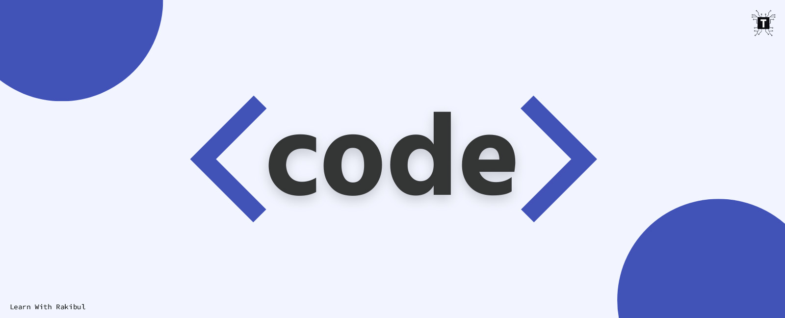

<h1 align="center">Hi 👋, I'm RAKIBUL HASAN(Rakib)</h1>
<h3 align="center">Programmer | Web Designer | Content Creator | Speed Learner</h3>

Skills: HTML / CSS / JAVASCRIPT

- 🔭 I’m currently learning on [Hablu Programmer](https://www.hablu-programmer.com/)

- 🌱 I’m currently learning Html, Css, Javascript

- 👨‍💻 All of my projects are available at [https://github.com/rakibul-hasan1](https://github.com/rakibul-hasan1)

- 💬 Ask me about **HTML5, CSS3, JS, Bootstrap**

<h3 align="left">Connect with me:</h3>

## Use To Code

 

## Best Repo -

  

 

 

## Github Stats -

  

<a> 
    
  
   
</a>

 

 

## Connect with me

 

  

